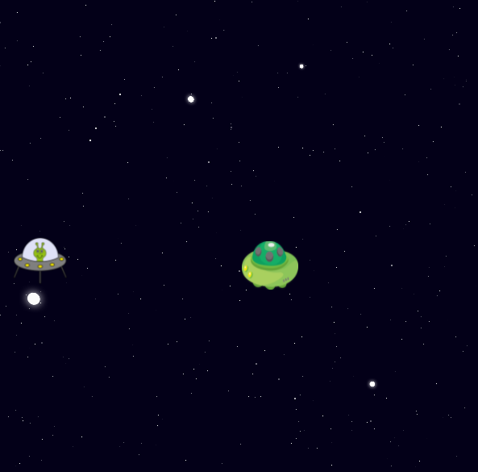
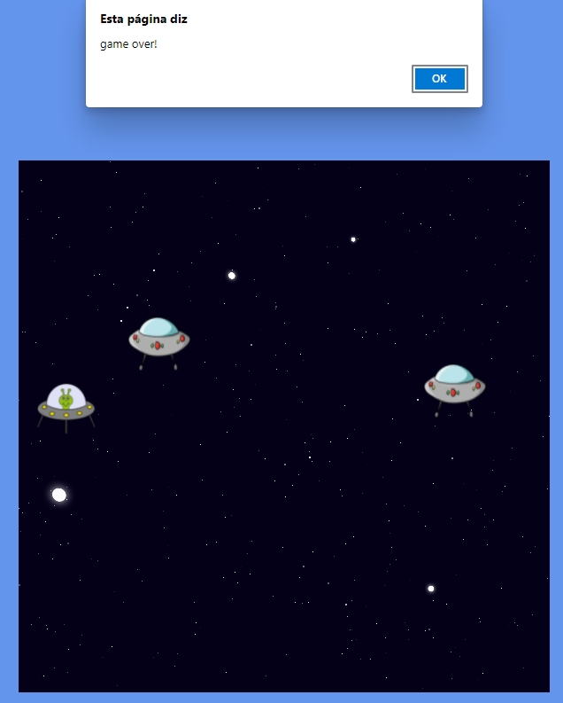

  

<h1 align="center">Criando jogo no estilo Space Shooter Digital Innovation One</h1>

Curso do Bootcamp JavaScript Game Developer da [Digital Innovation One](https://digitalinnovation.one/).

Nesse projeto, o desafio será criar um Space Shooter utilizando HTML, CSS e Javascript. Aprenderemos juntos a trabalhar com posicionamento no CSS e lógica de programação utilizando posicionamento com CSS, manipulação do DOM, eventListeners, e manipulação de Array.

### Os requisitos são:

* [HTML básico](https://www.w3schools.com/html/)
* [CSS básico](https://developer.mozilla.org/pt-BR/docs/Web/CSS)
* [Javascript básico](https://developer.mozilla.org/pt-BR/docs/Web/JavaScript)
 

## 🚀 Let's code! 🚀
